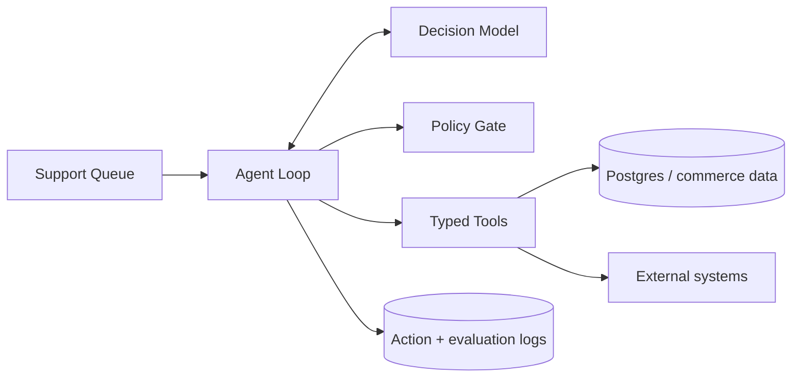

# Autonomous Commerce Support Agent

A portfolio project demonstrating how I would build an AI agent that does measurable work in a commerce environment instead of acting as a generic chatbot.

The agent reads open support tickets, gathers order context, classifies the request, calls narrowly-scoped tools, applies safety policies, resolves low-risk cases, and escalates higher-risk cases to a human.

## Why this project

The engineering goal is not "use an LLM everywhere." It is to automate a bounded workflow, expose every side effect through tools, measure outcomes, and remove or change the agent if it does not improve the operation.

## What the demo does

- Loads order context.
- Classifies a support ticket.
- Checks shipment or artwork state.
- Applies an explicit autonomous-action policy.
- Can issue a small bounded service credit.
- Sends a customer reply for safe cases.
- Escalates refunds, uncertain requests, high-value orders, and artwork review.
- Produces an auditable action history.

## Safety design

The model cannot directly modify business state. All mutations go through typed tools. The tool layer enforces limits even if a model proposes a bad action.

Current demo limits:

- Maximum autonomous credit: **$15**
- Maximum order value for autonomous resolution: **$150**
- Maximum agent steps: **8**

## Run locally

This repository intentionally has no runtime dependencies for the deterministic demo.

```bash
npm run build
npm test
npm run demo
```

The included deterministic model makes the repository reproducible for reviewers. `OpenAICompatibleJsonModel` shows how the planner can be swapped for an API-backed model while retaining the same tool and policy boundaries.

## Example workflow

```text
Ticket: "My order is late. Can you check the tracking and help?"
  -> get_order
  -> classify_ticket
  -> check_shipping
  -> issue_credit ($10, policy checked)
  -> send_customer_reply
  -> RESOLVED
```

A high-value order or refund request instead terminates in `escalate`.

## Architecture



See [`docs/architecture.md`](docs/architecture.md) for rollout and evaluation notes.

## Postgres + GraphQL

The runnable sample uses an in-memory repository so a reviewer can execute it immediately. The production persistence contract is represented in [`db/schema.sql`](db/schema.sql), and a proposed GraphQL boundary is included in [`graphql/schema.graphql`](graphql/schema.graphql).

The repository interface is intentionally independent from persistence so an actual Postgres adapter can replace the in-memory implementation without changing the agent loop.

## Production improvements I would make next

1. Postgres repository implementation with transaction/idempotency keys.
2. Authenticated GraphQL API and role-scoped tool permissions.
3. Shadow-mode evaluator using historical tickets before enabling side effects.
4. Model comparison harness for OpenAI, Claude, Grok, and open-source models.
5. Prompt/version registry and per-run cost/latency metrics.
6. GCP deployment with Cloud Run, Secret Manager, Cloud SQL, and structured logging.
7. Replayable test corpus for regression evaluation whenever a model or prompt changes.

## What I would measure

An agent only matters if it improves the operation. I would monitor autonomous resolution rate, false-resolution rate, escalation precision, median resolution time, customer satisfaction, service-recovery cost, model/tool cost, and estimated human minutes saved.

## Repository structure

```text
src/
  agent.ts        autonomous control loop
  models.ts       deterministic + API-backed decision models
  tools.ts        typed side-effect boundary
  policy.ts       human-in-the-loop limits
  repository.ts   persistence interface + demo repository
  fixtures.ts     reproducible test data
  tests.ts        safety and behavior checks
  demo.ts         runnable demonstration
db/schema.sql     PostgreSQL design
graphql/schema.graphql
docs/architecture.md
```

## Author note

I built this project specifically to demonstrate the way I approach agent engineering: start from a business workflow, keep authority bounded, make actions observable, and evaluate the result rather than treating model output as the product.
